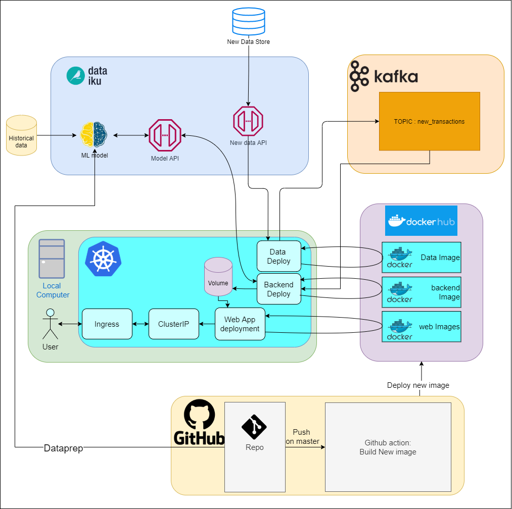

# Big data : Hexagone M2 IA

## Project description

1. Build a performing Machine Learning model to predict one’s income level. Details should be paid on how to measure and challenge this model performance, and if needed how to improve it. 
2. Deploy the model as an API service, that you can then integrate within the infrastructure you learned to build along this course. 

## Project architecture
### Architecture

### ML
#### Data exploration
- [ ] Data exploration
- [ ] Data visualization

#### Data preprocessing
- [ ] Data cleaning
- [ ] Data transformation

#### Feature engineering
- [ ] Feature selection
- [ ] Feature augmentation

#### Model training
- [ ] Model selection
- [ ] Model training
- [ ] Model evaluation
- [ ] Model optimization

### API
#### API design
- [x] API design : Dataiku built-in API
#### API deployment
- [ ] API creation
- [ ] API deployment : Dataiku built-in API

### Infrastructure
#### Github 

- [x] Github Actions
- [x] Github Secrets
#### Docker
- [ ] Dockerfiles
- [x] Docker Hub account
#### Kafka
- [x] Kafka cluster
- [x] Kafka topic

#### Python Code

- [x] Python code for Producer
- [x] Python code for Consumer
- [ ] Python code for web app
